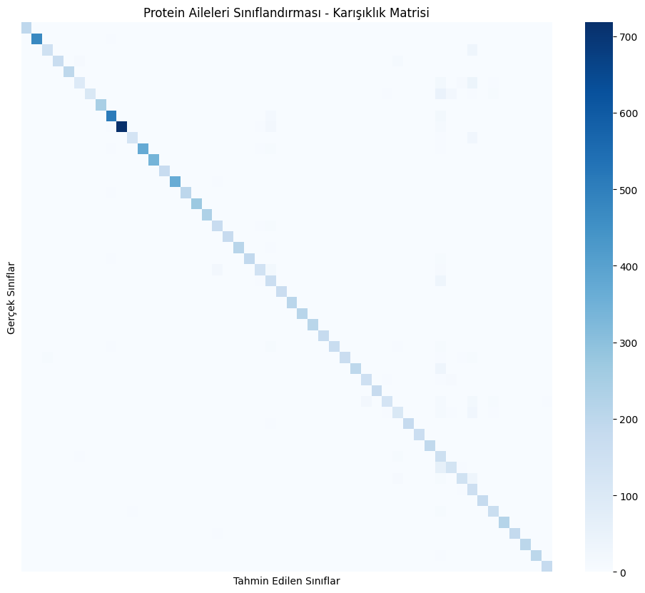

# ProteinBERT ve Hibrit (PyTorch-TensorFlow) Mimari ile Protein Ailesi Sınıflandırması

Bu depo, UniProtKB/Swiss-Prot veri setinde bulunan amino asit dizilerini doğal dil işleme (NLP) yöntemleriyle ele alarak protein ailelerinin otomatik sınıflandırılmasını amaçlayan akademik projeyi içermektedir.

Geliştirilen projede, salt performans ve eğitim hızı optimizasyonu sağlamak adına özellik çıkarımı (feature extraction) için **PyTorch** tabanlı önceden eğitilmiş model (ProtBERT) kullanılmış; elde edilen özelliklerin sınıflandırılması aşamasında ise **TensorFlow/Keras** altyapısına geçilerek hibrit bir mimari tasarlanmıştır.

## Projenin Amacı ve Motivasyon
Yeni nesil sekanslama teknolojileri ile milyonlarca protein dizisine erişilebilmesine karşın, bu proteinlerin işlevlerinin laboratuvar ortamında bulunması çok maliyetlidir. Amino asit dizilimlerinin (örn: `M V L S P...`) cümlelerdeki kelimeler gibi ardışık ve kurallı bir yapıya sahip olması, metin madenciliğinde devrim yaratan **Büyük Dil Modellerinin (LLMs)** biyoinformatik alanında da kullanılabileceği fikrini doğurmuştur. 

Bu çalışmada, protein dizilerini bağlamsal olarak anlamak için devasa veri setleriyle önceden eğitilmiş olan `Rostlab/prot_bert` modeli kullanılmıştır.

---

## Veri Setinin İndirilmesi ve Drive'a Aktarılması
Çalışmada, 574.000'den fazla manuel olarak gözden geçirilmiş ve küratöre edilmiş protein dizisini içeren **UniProtKB/Swiss-Prot** veri tabanı kullanılmıştır. Kodu kendi ortamınızda çalıştırmak için veriyi aşağıdaki adımlarla hazırlamalısınız:

**1. Veriyi İndirme:**
* [UniProt Downloads](https://www.uniprot.org/help/downloads) adresine gidin veya doğrudan UniProt arama ekranından `reviewed:true` (Swiss-Prot) filtresini uygulayın.
* İndirme formatı olarak NLP modelleriyle kolay çalışabilmek adına FASTA yerine **TSV (Tab-Separated Values)** formatını seçin.
* Sütun seçeneklerinden modelin girdisi ve çıktısı olacak olan **"Sequence" (Dizi)** ve **"Protein families" (Protein aileleri)** sütunlarının seçili olduğundan emin olun.
* Dosyayı sıkıştırılmış olarak (`uniprot_sprot.tsv.gz`) bilgisayarınıza indirin.

**2. Google Drive'a Yükleme (Colab Kullanıcıları İçin):**
* Google Drive'ınızda `DerinOgrenme` (veya benzeri) bir klasör oluşturun.
* İndirdiğiniz `.tsv.gz` dosyasını bu klasöre yükleyin.

**3. Colab'a Bağlama:**
Notebook içerisinde aşağıdaki kod bloğu ile Drive'ınızı bağlayabilir ve veriyi Pandas ile okuyabilirsiniz:
```python
from google.colab import drive
import pandas as pd

drive.mount('/content/drive')
# Dosya yolunu kendi Drive yapınıza göre güncelleyin
df = pd.read_csv('/content/drive/MyDrive/DerinOgrenme/uniprot_sprot.tsv.gz', sep='\t', compression='gzip')
```

---

## Yöntem: Neden Hibrit Mimari (PyTorch + TensorFlow)?
Modelin devasa parametre (milyarlarca) boyutlarına sahip olması nedeniyle, baştan başa uçtan uca eğitilmesi (Full Fine-Tuning) yerel donanımlarda VRAM darboğazlarına ve saatler süren eğitim sürelerine neden olmaktadır. Bu sorunu çözmek için aşağıdaki hibrit "Özellik Çıkarımı" (Feature Extraction) stratejisi geliştirilmiştir:

* **PyTorch ile Ağır Yükün İşlenmesi:** Temel model PyTorch ortamında yüklenip dondurulmuştur (requires_grad=False). İleri besleme (forward pass) yapılarak her protein dizisi için [CLS] token'ı (1024 boyutlu bağlam vektörü) özellik olarak çıkartılmış ve .npy formatında kaydedilmiştir.

* **TensorFlow/Keras ile Hızlı Prototipleme:** NLP problemi standart bir tablosal formata dönüştükten sonra, çok daha pratik olan TensorFlow/Keras ortamına dönülerek sınıflandırma başlığı inşa edilmiştir.

---

## Veri Ön İşleme ve Model Mimarisi

* **Veri Seti:** UniProtKB/Swiss-Prot

* **Veri Boyutu:** 57.740 örnek, 50 Sınıf (Filtrelenmiş)

* **Tokenizasyon:** BertTokenizer, Maksimum Dizi Uzunluğu: 128

* **Sınıflandırıcı Başlık:** TensorFlow Keras, %10 Dropout, 50 Çıktılı Dense Katmanı

* **Kullanılan Teknolojiler ve Kütüphaneler:** `PyTorch`, `TensorFlow` (Keras), `Transformers` (Hugging Face), `Pandas`, `Scikit-Learn`, `NumPy`.

---

## Deneysel Sonuçlar ve Performans Metrikleri
Eğitim sürecinde yalnızca sınıflandırma başlığının (classification head) ağırlıkları güncellendiği için hesaplama maliyeti büyük ölçüde düşürülmüştür. Bu yaklaşım, kullanılan donanım altyapısına bağlı olmakla birlikte, tam model eğitimine (full fine-tuning) kıyasla eğitim süresini minimize etmiş ve model 3 epoch gibi kısa bir sürede yüksek başarımla yakınsamıştır (convergence):

* **Doğruluk (Accuracy):** %91.18

* **Ağırlıklı F1 Skoru (Weighted F1):** %91.85

---

## Grafiksel Analiz ve Sınıflandırma Raporunun Yorumlanması

<div align="center">
  
  <br>
  <i> Modelin Sınıflandırma Başarısı (Confusion Matrix)</i>
</div>

Modelin 3 epoch sonucunda elde ettiği sınıflandırma raporu (Classification Report) ve yukarıdaki Karışıklık Matrisi (Confusion Matrix) incelendiğinde şu sonuçlara ulaşılmıştır:

* **Mükemmel İzolasyon ve Yüksek Kararlılık:** Matrisin ana köşegeninde (diyagonal) yoğunlaşan koyu renkli hücreler, modelin genel başarısını görselleştirmektedir. Rapor detaylarına bakıldığında; Sınıf 0, 4, 7, 12, 13, 17, 19, 26, 27 ve 45 gibi birçok protein ailesinde F1-Skorunun %99 ile %100 arasına ulaştığı görülmektedir. Bu durum, Transformer "dikkat (attention)" mekanizmasının, yapısal olarak belirgin olan protein ailelerinin biyolojik bağlamını kusursuz şekilde ayırt ettiğini kanıtlamaktadır.

* **Hassasiyet (Precision) Düşüklüğü Yaşanan Sınıflar:** Matrisin köşegen dışında kalan kısımlarındaki hatalı tahmin dağılımları spesifik alt sınıflarda yoğunlaşmıştır. Özellikle Sınıf 39 (Precision: %32) ve Sınıf 42 (Precision: %44) etiketlerinde model yoğun şekilde Yanlış Pozitif (False Positive) hataları yapmıştır. Model, yapısal olarak benzeyen başka protein dizilerini yanlışlıkla bu iki sınıfa dahil etme eğilimi göstermiştir.

* **Duyarlılık (Recall) Düşüklüğü Yaşanan Sınıflar:** Benzer şekilde Sınıf 6 (Recall: %53) ve Sınıf 5 (Recall: %56) etiketlerinde tespit oranının düştüğü gözlemlenmiştir. Model, bu sınıflara ait gerçek proteinlerin neredeyse yarısını gözden kaçırarak başka ailelere atamıştır (Yanlış Negatif / False Negative).

* **Biyolojik Çıkarım:** Bu hata eğilimleri (39, 42, 5 ve 6. sınıflar) derin öğrenme modelinin bir zafiyetinden ziyade, bu protein ailelerinin evrimsel olarak birbirine çok benzeyen alt türler (örneğin Kinaz alt tipleri veya ortak çinko parmak domainleri) olmasından kaynaklanmaktadır.

---
